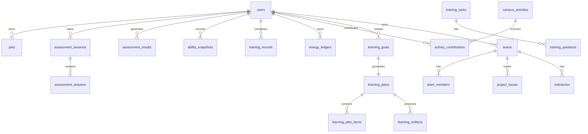

# 诈醒学集 — 后端与数据库架构说明

> 针对导师反馈“参赛项目不要只停留于前端网页，而要有数据库有后端”，本说明基于当前代码库与运行实例，系统梳理项目已有的后端服务、数据库结构与前后端联调机制，可直接用于答辩材料或评审说明。

---

## 1. 结论速览

- **本项目并非纯前端页面**：具备完整的 **FastAPI + SQLAlchemy + SQLite/PostgreSQL** 后端服务体系。
- **数据库实体丰富**：当前演示库 `demo_corrected.sqlite3` 包含 **53 张表**，覆盖用户、测评、能力画像、宠物成长、训练、知识库、学习集市、项目协作、校园活动、盾能账本、证据中心等全业务域。
- **API 规模**：后端自动生成 OpenAPI 文档，当前版本共 **115 个 API 路径**、**58 个 Pydantic 数据模型**。
- **生产化部署已准备**：提供 `docker-compose.yml`（PostgreSQL + 后端 + 前端）与 `nginx.conf`（反向代理、安全响应头、HTTPS 模板）。
- **运行验证通过**：后端已于 `http://localhost:8011` 启动，`/api/health`、`/api/activities`、`/api/knowledge/items`、`/api/auth/demo-login` 等核心接口均返回 200。

---

## 2. 技术栈

| 层级 | 技术/框架 | 版本/说明 |
|---|---|---|
| 前端 | React + TypeScript + Vite + Tailwind CSS | 构建产物为静态 SPA |
| 后端 | FastAPI | 0.115.6 |
| 服务器 | Uvicorn | 0.32.1 |
| ORM | SQLAlchemy | 2.0.36（同步 Session） |
| 数据校验 | Pydantic | v2 |
| 数据库（演示） | SQLite | `backend/data/demo_corrected.sqlite3` |
| 数据库（生产） | PostgreSQL | `docker-compose.yml` 中已配置 |
| 迁移 | Alembic | 已引入，`alembic_version` 表存在 |
| 部署 | Docker + Nginx | 包含生产编排与反向代理配置 |

---

## 3. 数据库结构

### 3.1 总体规模

- **数据库文件**：`backend/data/demo_corrected.sqlite3`（约 924 KB）
- **数据表数量**：53 张
- **核心数据量示例**：
  - 用户/账号：10 人（含演示账号 `U-2408**`）
  - 知识条目：67 条（11 个主题，均标注来源与外链）
  - 训练题库：52 题 / 训练任务：20 个 / 风险样本：220 条
  - 测评会话：8 次 / 测评结果：3 份 / 能力快照：1 份
  - 校园活动：5 个 / 活动贡献：6 笔 / 盾能账本：7 笔

### 3.2 按业务域划分的数据表

| 业务域 | 主要数据表 |
|---|---|
| **用户与认证** | `accounts`, `users`, 校园认证相关字段（`student_id`/`school`/`department`） |
| **测评与能力画像** | `assessment_sessions`, `assessment_answers`, `assessment_results`, `question_metadata`, `ability_snapshots`, `ability_events` |
| **宠物与成长** | `pets`, `pet_pool`, `growth_rules` |
| **训练与情景对话** | `training_tasks`, `training_questions`, `training_records`, `scenario_templates`, `scenario_training_sessions`, `scenario_turns`, `retrain_tasks` |
| **知识库** | `knowledge_items`（含 `theme`, `source`, `source_url` 字段） |
| **AI 任务包** | `task_packages`, `task_package_items` |
| **AI 学习集市** | `learning_goals`, `learning_plans`, `learning_plan_items`, `learning_plan_extensions`, `learning_artifacts`, `learning_artifact_versions`, `learning_market_listings` |
| **集市互动** | `market_comments`, `market_likes`, `market_favorites`, `market_ratings` |
| **主题与盾能（V3.0）** | `themes`, `energy_ledgers`, `campus_activities`, `activity_contributions`, `campus_activity_unlocks` |
| **项目式协作** | `teams`, `team_members`, `project_issues`, `milestones` |
| **社交与通知** | `friendships`, `notifications` |
| **证据中心与日志** | `evidence_records`, `ai_call_logs`, `review_reports`, `prompt_versions`, `fraud_cases`, `suspicious_checks` |
| **系统/迁移** | `alembic_version` |

### 3.3 核心 ER 关系示意



---

## 4. 后端 API 体系

### 4.1 规模统计

- **API 路径总数**：115 个
- **HTTP 方法分布**：GET 53、POST 64、PATCH 3、PUT 1、DELETE 2
- **Pydantic 模型数**：58 个
- OpenAPI 文档实时地址：`http://localhost:8011/docs`（启动后）
- 本次快照文件：`backend/openapi_snapshot.json`

### 4.2 按业务域列出的关键接口

| 业务域 | 示例接口 | 说明 |
|---|---|---|
| **认证** | `POST /api/auth/login`<br>`POST /api/auth/register`<br>`POST /api/auth/demo-login`<br>`POST /api/campus/login` | 账号密码、注册、演示一键登录、校园统一认证 |
| **测评** | `GET /api/assessment/questions`<br>`POST /api/assessment/submit`<br>`GET /api/assessment/ability-profile`<br>`POST /api/v1/assessment/sessions` | 10 题/标准测评、五维能力画像、错题记录 |
| **宠物** | `GET /api/pets/pool`<br>`POST /api/pets/claim`<br>`GET /api/pets/my`<br>`GET /api/pets/profile` | 宠物领取、成长等级、阶段进化 |
| **训练** | `GET /api/training/tasks`<br>`POST /api/training/submit`<br>`POST /api/training/scenario/start`<br>`POST /api/training/scenario/{id}/reply` | 训练任务、情景对话、AI 状态机 |
| **知识库** | `GET /api/knowledge/items`<br>`GET /api/knowledge/themes`<br>`GET /api/knowledge/categories`<br>`POST /api/knowledge/analyze-image` | 多主题知识、来源追溯、图片风险分析 |
| **主题/盾能/活动** | `GET /api/theme/list`<br>`GET /api/energy/balance`<br>`GET /api/energy/ledger`<br>`GET /api/activities`<br>`POST /api/activities/{id}/contribute` | 校方主题、统一盾能账本、校园活动共建 |
| **AI 学习集市** | `GET /api/learning/market`<br>`POST /api/learning/goals`<br>`POST /api/learning/plans/{id}/share`<br>`POST /api/learning/artifacts` | 目标制定、任务包、成果发布、复用 |
| **协作/社交/通知** | `GET /api/teams`<br>`POST /api/teams/{id}/members`<br>`GET /api/social/friends`<br>`GET /api/notifications/unread-count` | 团队项目、好友、消息通知 |
| **证据/管理** | `GET /api/evidence/overview`<br>`GET /api/evidence/ai-logs`<br>`POST /api/admin/cases/{id}/analyze` | AI 调用审计、风控案例、管理员后台 |

---

## 5. 前后端联调机制

### 5.1 开发环境

- 前端 dev server 监听端口 `5181/5182`（`vite.demo.config.ts`）。
- `/api` 请求通过 Vite `server.proxy` 代理到后端 `http://localhost:8011`。
- 后端 CORS 已配置允许 `http://localhost:5173` 等本地地址。

### 5.2 生产环境

- `docker-compose.yml` 启动 3 个服务：PostgreSQL、后端（端口 8000）、前端 Nginx（端口 80）。
- `nginx.conf` 将 `/api/` 反向代理到后端容器，并启用：
  - gzip 压缩
  - 安全响应头（X-Content-Type-Options、X-Frame-Options、Referrer-Policy、Permissions-Policy）
  - SPA 路由回退
  - 上传大小限制（12 MB）
  - HTTPS 模板（注释状态，可一键启用）

### 5.3 安全与门控

- 账号密码使用 `password_hash` 存储。
- `users` 表含 `role`（student/school）、`token`、`student_id`、`school`、`department`。
- 演示登录接口 `/api/auth/demo-login` 与 `/api/school/demo-login` 已接入 `AUTH_REQUIRED` 环境变量门控：生产环境设为 `true` 时返回 403，本地开发仍可一键进入。

---

## 6. 数据持久化与初始化

1. **建表**：`Base.metadata.create_all(engine)` 在应用启动时自动创建缺失的表。
2. **迁移**：`main.py` 启动时执行 `_migrate_pets_table` 与 `_migrate_v3_columns`，为旧库补列并回填默认值，保证向后兼容。
3. **种子数据**：启动时调用 `seed_database`、`seed_question_metadata`、`seed_risk_test_samples`，写入默认账号、题库、风险样本、宠物池、成长规则等。
4. **Alembic**：项目已引入 Alembic，数据库中存在 `alembic_version` 表，可进一步演进生产迁移脚本。

---

## 7. 启动与验证方式

### 7.1 启动后端（使用隔离 venv）

```bash
cd 01_source_main_demo/fraud-pet-demo/backend
DATABASE_URL=sqlite:///./data/demo_corrected.sqlite3 \
  C:/Users/33719/.workbuddy/binaries/python/envs/fraud_demo/Scripts/uvicorn.exe \
  app.main:app --port 8011 --host 0.0.0.0
```

### 7.2 启动前端（演示模式）

```bash
cd 01_source_main_demo/fraud-pet-demo
unset CODEBUDDY_SESSION_ID
C:/Users/33719/.workbuddy/binaries/node/versions/22.22.2/node.exe \
  ./node_modules/vite/bin/vite.js --config vite.demo.config.ts
```

### 7.3 本次验证结果

| 验证项 | URL | 状态 |
|---|---|---|
| 健康检查 | `GET /api/health` | 200 |
| 活动列表 | `GET /api/activities` | 200 |
| 知识条目 | `GET /api/knowledge/items` | 200 |
| 演示登录 | `POST /api/auth/demo-login` | 200 |

> 后端当前运行在 `http://localhost:8011`，OpenAPI 文档可访问 `http://localhost:8011/docs`。

---

## 8. 生产部署（一键模板）

```bash
# 1. 修改环境变量与密码后执行
cd 01_source_main_demo/fraud-pet-demo
docker compose up --build -d

# 2. 检查健康状态
curl http://localhost/api/health
```

生产部署默认使用 PostgreSQL，并开启 `AUTH_REQUIRED=true` 关闭演示一键登录，符合答辩/正式交付要求。

---

## 9. 附件

- 后端 OpenAPI 实时快照：`backend/openapi_snapshot.json`
- 生产编排：`docker-compose.yml`
- Nginx 配置：`nginx.conf`
- 后端入口：`backend/app/main.py`
- ORM 模型：`backend/app/models.py`
- 数据库会话基础设施：`backend/app/database.py`

---

*本说明生成时间：2026-08-26。后续如新增表或接口，可直接重新拉取 `/openapi.json` 更新本文件中的统计数据。*
